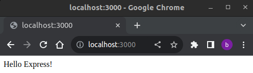
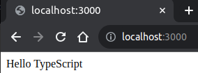

# Activity 0

## install nodejs and npm

```
cd ~/git/cv64/gcuStudent/CST391/solutions/activity0
sudo apt install nodejs
node -v
sudo apt install npm
npm -v
curl -sL https://deb.nodesource.com/setup_18.16.0 -o /tmp/nodesource_setup.sh
nano /tmp/nodesource_setup.sh
sudo bash /tmp/nodesource_setup.sh
sudo apt install nodejs
```

## NodeJS "Hello World" Application

```
cd hello
gedit app.js &
node app.js
```
Hello NodeJS!

## Express "Hello World" Application

```
cd helloex
npm init     <- accept all the defaults
sudo npm install express
node app.js
sudo npm install -g nodemon
sudo nodemon app.js
```


## NodeJS with TypeScript

```
mkdir MusicAPI
cd MusicAPI/
sudo npm init     <- accept all the defaults
sudo npm i express
sudo npm i --save-dev typescript @types/express
mkdir src
cd src/
cp ../../../../docs/week01/activity0_app.ts app.ts
sudo npm i typescript@latest -g
touch tsconfig.json
sudo tsc --init
sudo npm install -g ts-node
sudo ts-node app.ts 
```


