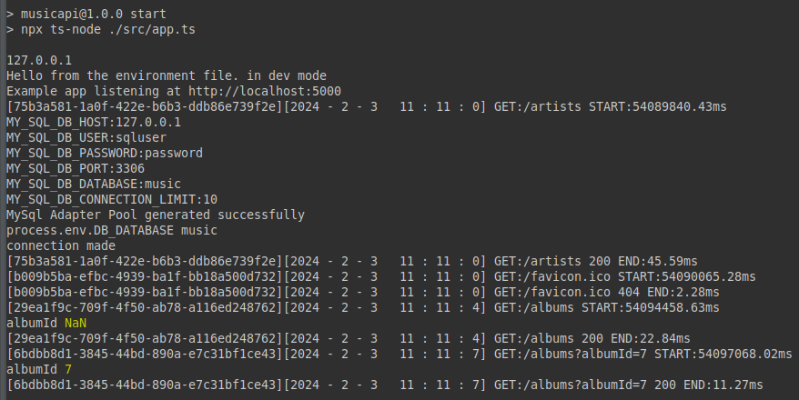

# Activity 1

## Executive Summary

- Activity 1 is an example of a Web Application interfacing to a MySQL Relational Database
     - The Architecture will be utilizing Model View Controller (MVC)
          - Model - the maintainer of the data, e.g. Database
          - View - the User Interface, currently the Web Browser
          - Controller - Middleware and the Management / Coordinator of the Application
     - The products utilized in the activity are the following:
          - [Node JS](https://nodejs.org/en)
          - [Node Package Manager](https://www.npmjs.com/)
          - [Express API](https://expressjs.com/en/api.html)
          - [TypeScript](https://www.typescriptlang.org/)
          - [MySQL](https://www.mysql.com/)
     
## Recordings

- The following are recordings
     - The first link is an online link to watch in a Web Browser
     - The second link is the source that can be downloaded and watched in a Video Player
     
     - [Activity 1 Online](https://rumble.com/v3razbl-cst391-activity-1.html)
     - [Activity 1 Download](https://cv64.us/gcu/recordings/)

## Environmental Variables (~/git/cv64/gcuStudent/CST391/solutions/activity1/MusicAPI/.env)

- The following are the variables defined for the MySQL Database

```
#MySQL Settings
MY_SQL_DB_HOST=127.0.0.1
MY_SQL_DB_USER=root
MY_SQL_DB_PASSWORD=password
MY_SQL_DB_PORT=3306
MY_SQL_DB_DATABASE=music
MY_SQL_DB_CONNECTION_LIMIT=10

#Server Settings
PORT=5000
NODE_ENV=development
GREETING=Hello from the environment file. Be kind to the environment!
```

## Database Initialization

- Start MySQL Workbench
- Copy [Initialization File](./CST-391MusicDBCurrentVersion.sql) into SQL Query
     - Icon SQL + under File in the application
- Execute Query


- [MySQL Reverse Engineering Instructions](https://gitlab.com/bobby.estey/wikibob/-/blob/master/docs/database/mysql/reverseEngineering/reverseEngineering.md)

## Activity 1 Commands

- The following commands are installation instructions for the various products required for this assignment

```
cd ~/git/cv64/gcuStudent/CST391/solutions/activity1/MusicAPI

npm install -g nodemon
npm install dotenv
npm install cors
npm install helmet
npm install mysql
npm install uuid
npm install @types/cors --save-dev
npm install @types/dotenv --save-dev
npm install @types/mysql --save-dev
npm install @types/uuid --save-dev
npm install nodemon --save-dev
npm install ts-node --save-dev

npm start
```

## Test Links

- The following are test links to validate the application is executing and communicating with the MySQL Database
- The images illustrate the results being display in the Web Browser

|Link|Browser Image|Postman Image|
|--|--|--|
|http://localhost:5000/artists|[Browser](artists.png)|[Postman](artistsPostman.png)|
|http://localhost:5000/albums|[Browser](albums.png)|[Postman](albumsPostman.png)|
|http://localhost:5000/albums?albumId=7|[Browser](albumId.png)|[Postman](albumIdPostman.png)|

- This is the System Output displaying the SQL variables, database connection and the GET method being called



## Troubleshooting

|Issue|Solution|
|--|--|
|MySQL error: ER_NOT_SUPPORTED_AUTH_MODE Client does not support authentication protocol requested by server; consider upgrading mysql client|create user 'sqluser'@'%' identified with mysql_native_password by 'password';<br><br>grant all privileges on \*.\* to 'sqluser'@'%';<br><br>flush privileges;|
