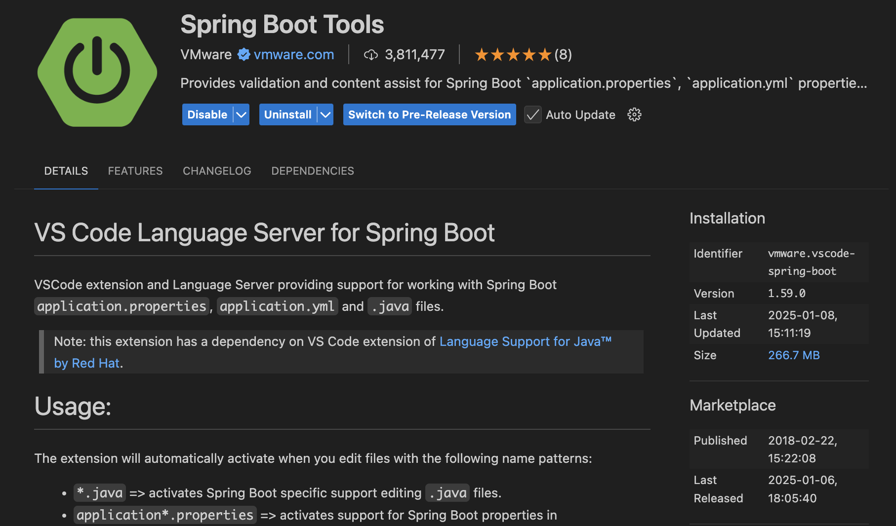
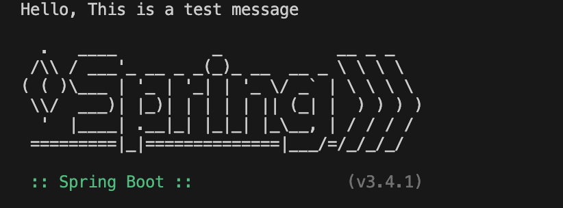

# CST339 - Activity 1

- Date:  **2025 January 08**
- Author:  **Trevor Marr**

## Introduction
- This is the final submission for Activity 1
- This activity will be installing the [Spring Tool Suite (STS)](https://spring.io/tools) on a local computing environment, creating a Spring Boot project and execute a simple **Hello World** application
- The [Maven (MVN)](https://gitlab.com/bobby.estey/wikibob/-/blob/master/docs/maven/README.md?ref_type=heads) tool is an open-source build automation and project management tool that will be used for building projects in this course
- The Project Object Model (POM) an eXtensible Markup Language (XML) file is utilized for project configurations

## Screenshots

- This is a screenshot of the Spring Tool Suite About Box

- This is a screenshot of the Console Output

- This is a screenshot of the Whitelabel Error Page

- This is a screenshot of the Hello World **index.html** page

## Research Questions

**1. Research Spring Boot. Compare building dynamic web applications when using Spring Boot versus just using the Spring framework. How do they differ?**
- Spring Boot simplifies the process of building dynamic web applications compared to the traditional Spring Framework by eliminating much of the manual configuration. Spring Boot provides auto-configuration, embedded web servers, and production-ready features like health checks and metrics, making it easier to set up and deploy applications. In contrast, the Spring Framework requires developers to manually configure components such as web servers and beans, often resulting in more boilerplate code. Spring Boot’s embedded server and sensible defaults streamline development, while the Spring Framework gives developers more control at the cost of complexity.

**2. Research Gradle, which is another popular build and dependency management tool. How does it differ from Maven?**
- Gradle and Maven are both build automation tools used in Java projects, but they differ in their configuration and performance. Maven uses XML for configuration, which can be verbose, while Gradle uses a more concise and flexible Groovy or Kotlin-based DSL. Gradle is known for its superior performance, supporting incremental builds and parallel execution, which makes it faster than Maven, particularly for large projects. Although Maven has a larger ecosystem and community, Gradle offers greater customization and flexibility, making it suitable for complex projects that need fine-grained control over the build process.

## Conclusion

- This was a semi-difficult assignment as most of the items were recorded from a different IDE and i had todo a lot of manual translating to work for my IDE: VS Code. Overall the assignment was a good refresher on what Maven is and how we will use it this semester with Spring Boot.
