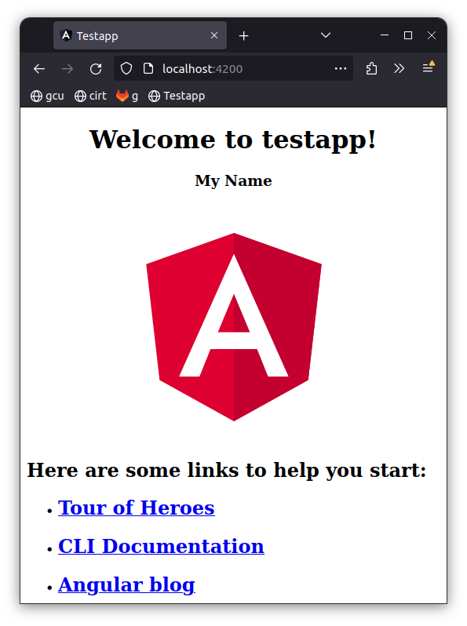

# Activity 2

## Activity 2 Commands

```
npm install -g @angular/cli --latest
ng version
ng new testapp
cd testapp
ng serve
```

## Test Links

- http://localhost:4200



## Deliverables

- Cover Page
- Executive Summary
- Captioned screenshots with explanations of each page
- Conclusion

## Troubleshooting

|Issue|Solution|
|--|--|
||||
