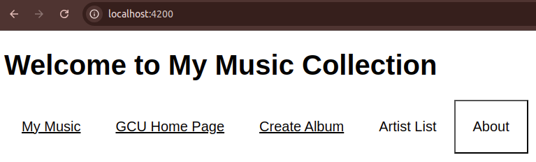

# Activity 3

## Activity 3 Commands

```
npm install
npm install -g @angular/cli --latest
npm install jquery --save-dev
npm install bootstrap
npm install @popperjs/core
ng version
ng serve
```

## sample-music-data.json (missing)

- Download the file from here: [sample-music-data.json](https://gitlab.com/bobby.estey/gcuStudent/-/blob/main/CST391/solutions/activity3/sample-music-data.json?ref_type=heads)
 
## Test Links

- http://localhost:4200



## Deliverables

- Cover Page
- Executive Summary
- Captioned screenshots with explanations of each page
     - The initial application page
     - GCU homepage
     - Create Album page
     - Artist List page showing your added album/artist
     - About Box
- Conclusion

## Troubleshooting

|Issue|Solution|
|--|--|
|ng new simpleapp --no-standalone|- Angular 17, when creating a new application without standalone requires the "--no-standalone" option to access the app.module.ts file|
     
