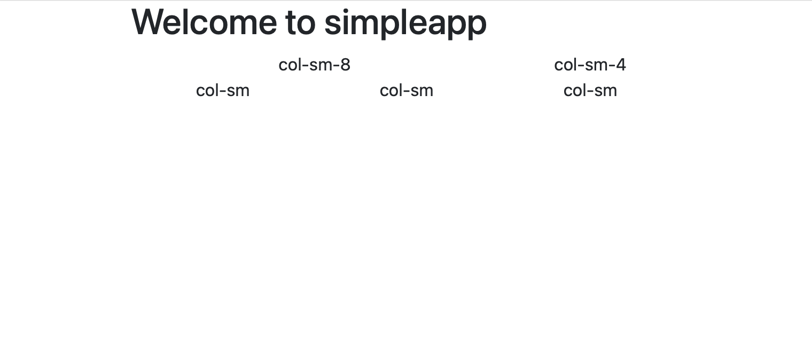
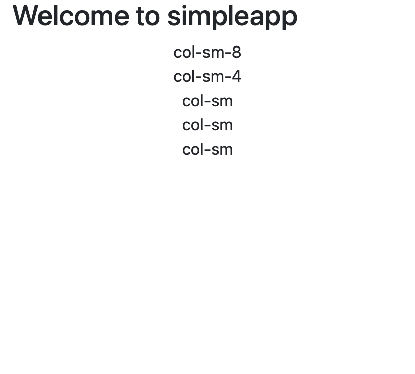
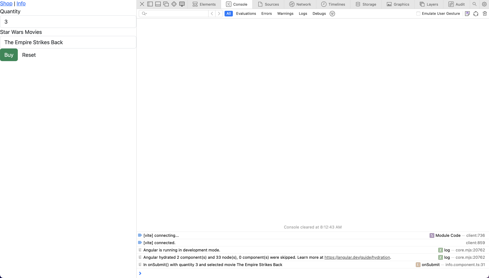
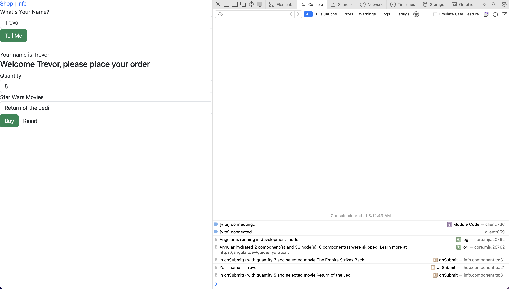
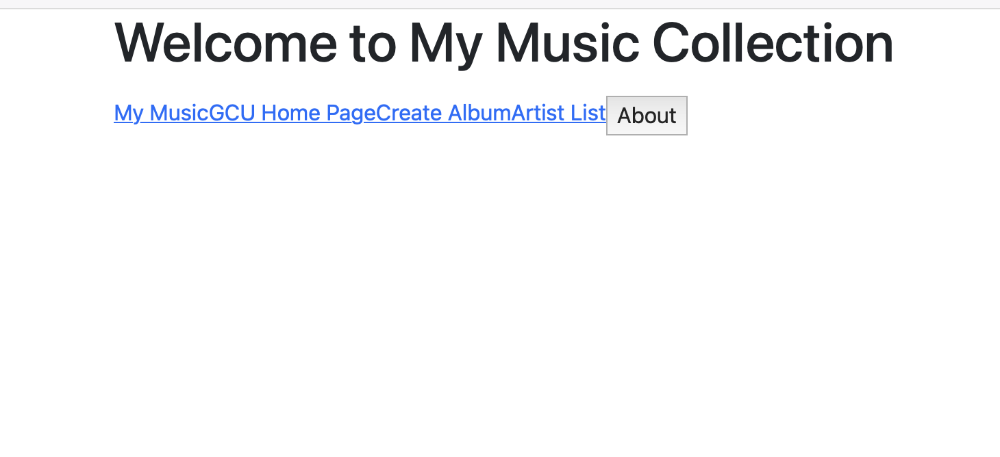
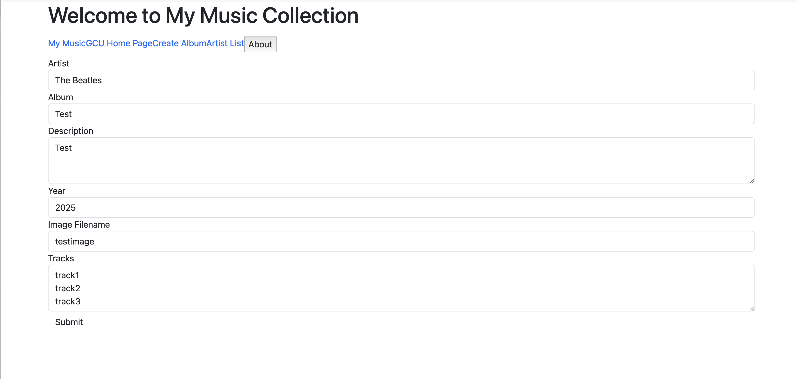
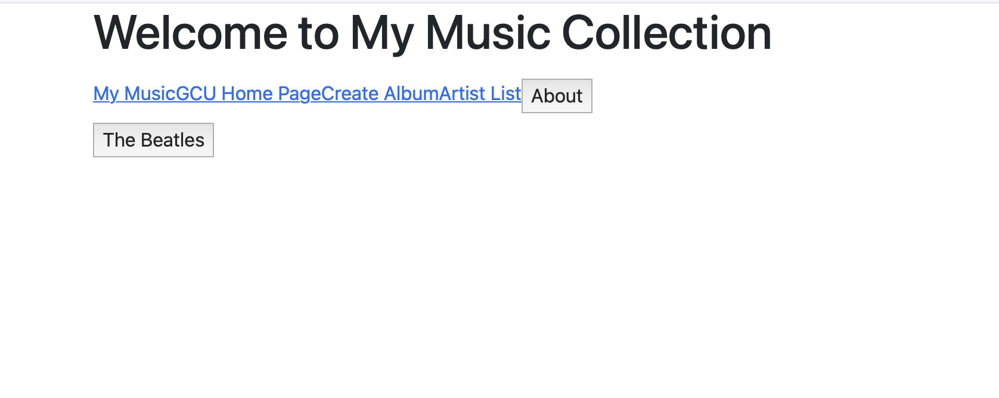
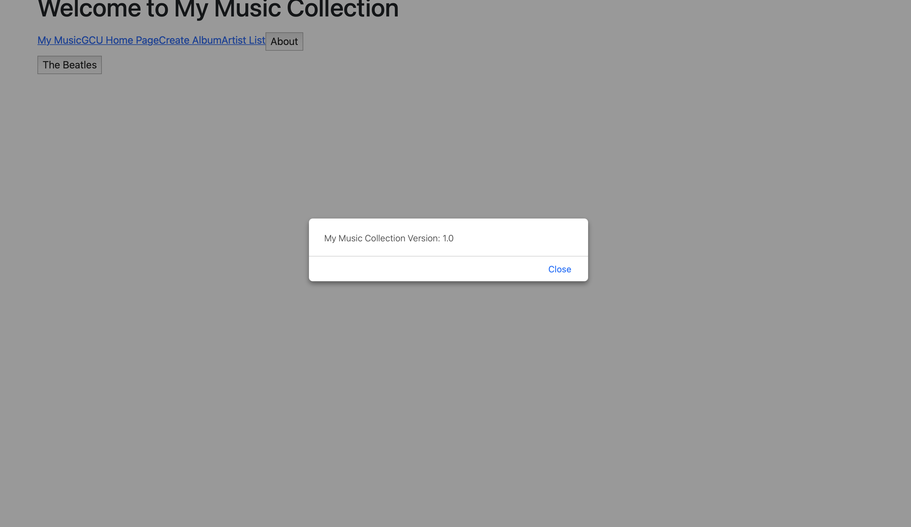

# CST-391 | Activity 3 Angular Tools & First App
#### Author: Trevor Marr
#### Date: 2025 25 Feb
````
**READ ME**

All screenshots and write-ups are my own work, i copied the assignment directions into this file so it is easier to follow.
````
---


## Part 1: Basic Angular Components, Events, Routes, and Data Binding

### Create a Simple Application
1. In the Terminal, navigate to the location where you want the simple application to be created and create a directory named simpleapp. Navigate to the simpleapp directory.
2. Run the following Angular CLI command m,and select the Angular route and CSS options during the installation:
````bash 
  ng new simpleapp
  ````

3. Create a VS Code Workspace by performing the following steps:
   - Open VS Code. Close the existing Workspace if one is opened.
   - Click the App Workspace Folder hyperlink from the VS Code start screen.
   - Select the simpleapp directory where the Simple application was created.
   - Select the File > Save Workspace As menu options and save your Workspace so VS Code can be opened again in the future.

4. In the Terminal, navigate to the test application directory and run the following command to start the Node server. Your browser should automatically be started with the application running.
````bash
ng serve --o
````

5. Add Bootstrap and Popper Modules to the test application by running the following commands.
````bash
npm install bootstrap
npm install @popperjs/core
````

6. Open the `angular.json` file in the root folder and add the following as the first entry in the styles array (keep the quotes):
````json
"node_modules/bootstrap/dist/css/bootstrap.css"
````

7. In the same `angular.json file`, add the following entries in the scripts array:
````json
"node_modules/bootstrap/dist/js/bootstrap.bundle.js" 
````

8. Open `app.component.html` and replace its contents with a Bootstrap grid found here.

9. Use Chrome Dev Tools to verify that your grid is responsive. The grid layout should change as you toggle between device emulation:

10. Take two screenshots, small screen and large, to demonstrate the responsive grid.





### Simple Data Binding to Labels and Handling a Form Post

1. Navigate to the root directory of the application and build a new component using the following command. Inspect the App Module and note that the new Shop Module has been added and registered with the application.
````bash
ng generate component shop
````
- Add a new property named question to the Shop Component and set its value to "What’s your name?"
- Add a new property named answer to the Shop Component and set its value to "unknown".
- In the App Module, import the following module to support reactive forms:
````ts
import { ReactiveFormsModule } from '@angular/forms';

imports: [
BrowserModule,
ReactiveFormsModule,
AppRoutingModule
],
````

- Add a Form Group to the Shop Component by adding the following code:
````ts
import { FormGroup, FormControl } from '@angular/forms';
````

- With the other properties:
````ts
appForm = new FormGroup({
answer: new FormControl(''),
});
````

- Add a form to the Shop Component view that has a single edit control bound to the answer form control and submits the form to the Shop Components onSubmit event handler. This approach is using a Model Driven Form.
````html
<form [formGroup]="appForm" (ngSubmit)="onSubmit(appForm.value)">

<div class="form-group">

<label>{{question}}</label>

<input type="text" class="form-control" formControlName="answer">

</div>

<button type="submit" class="btn btn-success">Tell Me</button>

</form> <br/>

<label>Your name is {{answer}}</label>
````

- In the Shop Component, add the onSubmit event handler to save the posted form data to the question property and log the answer to the browser's JavaScript console (remember this is code is running as JavaScript in your browser).
- Add the Shop Component to the App Component view by using the Shop Component tags. Start the server.


### Building a New Component with Leverage 2-Way Data Binding

1. Navigate to the root directory of the application and build a new Component using the following command. This is the same folder where app.module.ts resides. Inspect the App Module and note that the new Info Module has been added and registered with the application.
````bash
ng generate component info
````

2. Add three properties to the Info Component. The first property named quantity, the second property named products as an array, and the third property named selectectProduct. In the ngOnInit(), initialize the quantity, products, and selectedProduct properties as desired.

3. In the application Shop Component view, add the selector tags for the Info Component below the form.

4. Start the server and validate that the default Info Component is displayed.

5. In the App Module, import the following module to support template forms:
````ts
import { ReactiveFormsModule, FormsModule } from '@angular/forms';

imports: [
BrowserModule,
ReactiveFormsModule,
FormsModule,
AppRoutingModule
],
````

6. Forms in Angular have two choices; we are using both here. The 'Reactive' version has more code and is more flexible. FormsModule forms work more like traditional html forms and are easier to learn but less flexible than their 'Reactive' counterparts. Traditional html forms are a common feature of web development regardless of framework. It's best to become an expert on the traditional forms approach before studying the reactive version.

7. Update the Info Component view to display a form with an input text control for the quantity, a select list for the products, a submit button, and a reset button. Note the use of the ngModel syntax, which supports 2-way data binding. Add an onSubmit event handler for the submit button and a newInfo event handler for the reset button. The complete code:
````html
<br/>

<form (ngSubmit)="onSubmit()" #infoForm="ngForm">

<div class="form-group">

<label for="quantity">Quantity </label>

<input type="text" class="form-control" id="quantity" required

[(ngModel)]="quantity" name="quantity">

</div>

<div class="form-group">

<label for="products">Star Wars Movies</label>

<select class="form-control" id="products" required

[(ngModel)]="selectedProduct" name="products" #selected="ngModel">

<option *ngFor="let product of products"

[value]="product">{{product}}</option>

</select>

</div>

<button type="submit" class="btn btn-success" >Buy</button>

<button type="button" class="btn btn-default"

(click)="newInfo()">Reset</button>

</form>
````

8. Update the Info Component with an event handler for the submit button, which displays the quantity and selected product to the JavaScript console, and an event handler for the reset button that resets the values of the Info Component. Take a screenshot of the browser and JavaScript console.


9.  Update the Info Component to receive as input the answer from the Shop Component and display this on the Info Component. Also update the application to dynamically render parts of the page based on if a person's name has been entered. Make the following changes to the Info Component:

Update the Shop Component view to pass in the answer property of the Shop Component to the Info Component view:
````html
<app-info [name]="answer"></app-info>
````

Add the Input import and a new Input property to the Info Component:
````ts
import { Component, OnInit, Input } from '@angular/core';
@Input() name: string;
````

Update the Info Component view to display the name property in a Welcome message at the top of the view.
````html
Welcome {{name}}, please place your Order
````

Update the Shop Component view to dynamically render the name text and info form based on if a person's name has been entered. Note the use of the ngIf directive. Take a screenshot with no name entered (the default state of the screen) and with a person's name entered.
````html
<label *ngIf="answer != 'unknown'">Your name is {{answer}}</label>

<app-info [name]="answer" *ngIf="answer != 'unknown'"></app-info
````

### Research Questions:
1. Describe `@Input` decorator used in `info.component.ts`
   - The `@Input()` decorator is used to pass data from a parent component to the InfoComponent. In this case, `@Input()` `name: string = '';` allows the InfoComponent to receive a name value from a parent component dynamically. This ensures that when the component is rendered, it can display a personalized welcome message using the name variable.

2. Describe `[value]` used in `info.component.html`
   - The `[value]` binding in `<option *ngFor="let product of products" [value]="product">{{ product }}</option> `dynamically assigns the value attribute of each `<option>` tag. Each `<option>` gets its value from the product variable in the `*ngFor` loop. This ensures that when the user selects an option, the corresponding product value is stored in the selectedProduct variable.

3. Describe `[(ngModel)]` also used in `info.component.html`
   - The `[(ngModel)]` directive is used for **two-way data binding**, meaning it synchronizes the model (`quantity` and `selectedProduct`) with the form input fields. When the user updates the input field (`<input>` or `<select>`), the component’s properties (`quantity` and `selectedProduct`) automatically update. Similarly, if the component updates these properties, the UI reflects those changes immediately.
   - Example:
     ```html
     <input type="text" [(ngModel)]="quantity" name="quantity">
     ```
     - If the user types a new quantity, `quantity` in the `InfoComponent` gets updated. If `quantity` is changed programmatically in TypeScript, the input field updates accordingly.


## Part 2: Creating a Music Application - The Front End

### Create the Music Application

1. This Angular application (musicapp) will eventually connect with the MusicAPI developed in an earlier activity. For Activity 3, we will use mocked data to develop most of the required UI.
2. Follow the same initial instructions from Part 1 of this activity to create an Angular music application called musicapp.
   - Make sure you add routing support when you create the Angular application.
   - Add Bootstrap and Popper dependency libraries.

### Add Mock JSON and Album Images to the Application

1. Create a directory called data in the src directory.
2. Copy the sample-music-data.json file from "CST-391 Activity 3 Part 2 Resources" to the src/data directory.
3. Copy the provided file typings.d.ts in the root of your source directory. This will allow a file of json data to be treated as a TypeScript module.
4. In the tsconfig-app.json file add the following line to the compiler options:
````json
"resolveJsonModule": true,
"esModuleInterop": true,
````
5. For future development, create the following components:
````bash
ng generate component list-artists
ng generate component list-albums
ng generate component create-album
ng generate component display-album
ng generate component edit-album
ng generate component delete-album
````
### Create the Object Models

1. Create a models directory under the src/app directory. Copy the three object model classes from the Topic 1 Activity into the src/app/models directory
2. These models are available in the "CST-391 Activity 3 Part 2 Resources" zip folder.
3. Our client object models match exactly to the server's API object models.

### Update the Routes Module

1. Update the Routes Module in app-routing-module.ts, adding the routes for the all the Components to the routes array:
````ts
const routes: Routes = [
{ path: 'create', component: CreateAlbumComponent },
{ path: 'list-artists', component: ListArtistsComponent },
{ path: 'list-albums', component: ListAlbumsComponent },
{ path: 'display/:id', component: DisplayAlbumComponent },
{ path: 'edit/:artist/:id', component: EditAlbumComponent },
{ path: 'delete/:artist/:id', component: DeleteAlbumComponent }
];
````
*Note:* you will need to add imports for all components listed here. VSCode can add imports for you.

### Add a Bootstrap NavBar

app.component.html is included in the "CST-391 Activity 3 Part 2 Resources" zip folder.

Spend some time studying the NavBar and how it interacts with Angular.

1. Change the title property value to "My Music Collection."
2. Add a new version property and set its value to 1.0. Add a function displayVersion() that displays a JavaScript alert box with the version, which is called on the click of a button in the Bootstrap Navbar (setup below).
3. Add a function displayArtistList() that will pop an alert with a "display list here" message. Of course, this is a placeholder. This will be developed later.
4. Remove all the default content in the view except the router-outlet tags.
5. Display the application title:
````html
<div style="text-align:center">
<h1>
Welcome to {{ title }}
</h1>
</div>
````
6. Add a Bootstrap NavBar with the following links. Note, do not use the href attribute in the anchor tags but use the routerLink attribute from Angular:
   - Brand should navigate to # (i.e., self) and set to ‘My Music’. b. GCU Home Page should navigate to https://www.gcu.edu/.
   - Create should navigate to /create.
   - Artist List that calls the Components displayArtistList(). This will be implemented in a few steps, so for now, just log a message to the console.
   - About that calls the Components displayVersion().

### Create a Music Service that will Implement a Façade to Access the Music Data

1. Create a service directory under the src/app directory.
2. You can find a copy of music-service.service.ts in the "CST-391 Activity 3 Part 2 Resources" zip folder. Follow the description below and study the code. Copy the provided file into the newly created service directory. Spend your time studying the code.
3. Navigate to the src/app/service directory.
4. Run the following command in the Terminal:
````bash
ng generate service music-service
````

5. Navigate back to the root directory and start the server.
6. Implement the Music Service in the service/music-service.service.ts class:
   - Import the Music data file:
````ts
import * as exampledata from '../data/sample-music-data.json';
````
   - Import the object models:
````ts
import { Artist } from './../models/artists.model';
import { Album } from '../models/albums.model';
````
   - Create the following property:
````ts
albums: Album[] = exampledata;
````
 - Add a public method getArtists(): Artist[] that returns the artists property.
 - Add a public method getAlbums(artist:string):Album[] that returns the albums property.
 - Add a public method getAlbum(artist:string, id:number):Album that returns loops over the albums property, finds the matching Artist and Album ID, then returns the found Album else returns null.
 - Add a public method createAlbum(album:Album):number that adds the album parameter to the list of albums, using the array push()), and returns the Album's ID if OK, otherwise -1 if an error.
 - Add a public method updateAlbum(album:Album):number that returns loops over the albums property, finds the matching Album ID, then updates the Album in the albums property, using the array splice(), returns 0 if OK, otherwise returns -1 if the Album is not found.
 - Add a public method deleteAlbum(id:number, artist:string):number that returns loops over the albums property, finds the matching Album ID, then deletes the Album in the albums property, using the array splice(), returns 0 if OK, otherwise returns -1 if the Album is not found.


### Update the App Component to Navigate to the Artist List Component

1. In app.component.ts, inject a Router into the constructor with an import
````ts
import { Router } from '@angular/router';
constructor(private router: Router)
````
Notice the handy constructor syntax. When you add a visibility keyword—private in this case—to a constructor's parameter, the compiler automatically creates the member variable.

2. In the displayArtistList() method, add a navigation route to the Artist List Component that passes a timestemp in the query params (this is required to get the query params to changes to the Artist List Component gets reinitialized):
````ts
this.router.navigate(['list-artists'], { queryParams: { data: new Date()} });
````

### Implement the List Artist Component

1. In list-artists.component.ts, inject the Active Route and the Music Service into the constructor:
````ts
constructor(private route: ActivatedRoute, private service: MusicServiceService) {}
````

2. Create a selectedArtist property of type Artist | null.
   - Create a artists property of type Artist[].
````ts
selectedArtist: Artist | null = null;
artists: Artist[] = [];
````

3. In the ngOnInit() method, subscribe to the queryParams changes from the route and call the Music Service getArtists() method, which will set the artists property and set the selectedArtist property to null.
````ts
ngOnInit()
{
this.route.queryParams.subscribe(params => {
console.log("Getting data....");
this.artists = this.service.getArtists();
this.selectedArtist = null;
});
}
````

4. Create a onSelectArtist(artist: Artist) method that updates the selectedArtist property, which will be used as the button click event handler in the Artist List view.
````ts
onSelectArtist(artist: Artist) {

this.selectedArtist = artist;

}
````

5. Display the Artists List in the view


### Implement the Albums List Component.

1. In list-albums.component.ts, inject the Music Service into the constructor:
````ts
constructor(private service: MusicServiceService) {}
````

2. Create an artist property of type Artist, which takes as an input an Artist into the Component using the @Input decorator.
````ts
@Input() artist: Artist;
````

3. Create a albums property of type Album[], which is used to hold the currently list of Albums, that is initialized in ngOnInit() by calling the Music Service.
````ts
this.albums = this.service.getAlbumsOfArtist(this.artist!.artist);
````
4. Create a selectedAlbum property of type Album, which is used to hold the currently selected Album, that is initialized to null.
````ts
selectedAlbum: Album | null = null
````
5. Create a public onSelectAlbum(album: Album) method that updates the selectedAlbum property, which will be used as the button click event handler in the Album List view.
````ts
public onSelectAlbum(album: Album)
{

this.selectedAlbum = album;

}
````

6. Display the Albums List in the view:


### Implement the Display Album Component

1. In display-album.component.ts, create an album property of type Album, which takes as an input into the Component using the @Input decorator on the album property.

@Input() album: Album;

2. Display the Album in the view:

### Implement the Album Create Component.

For this component, copy the code found in "create-album" folder. Make sure the UI component displays and that a new album is added to the album list when submitted. Study and understand the code.

- New Artist
- Add a new artist


### Research
Add complete comments to music-service.service.ts. Include this commented code in a Microsoft Word document or a text document. Make sure your submission reads like a code file

### Captioned screenshots:
- The initial application page


- GCU homepage


- Create Album page


- Artist List page showing your added album/artist


- About Box



1. Research questions (the fully commented code).
   - Please see commented code [here](musicapp/src/app/service/music-service.service.ts).