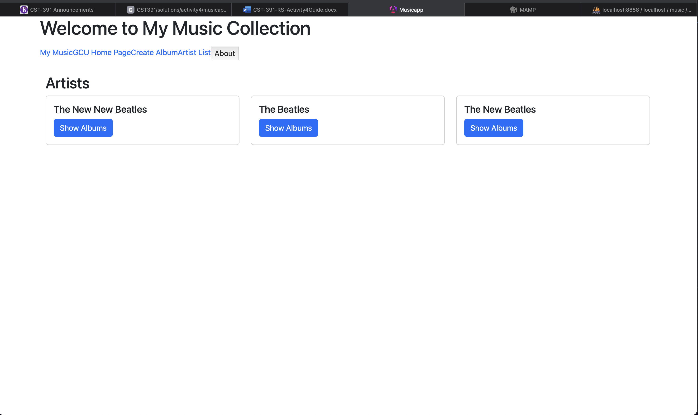
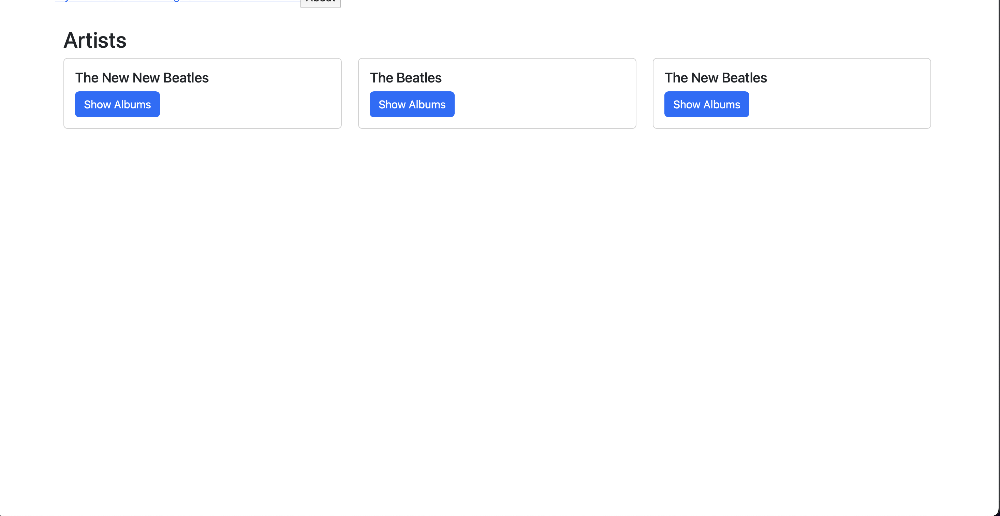
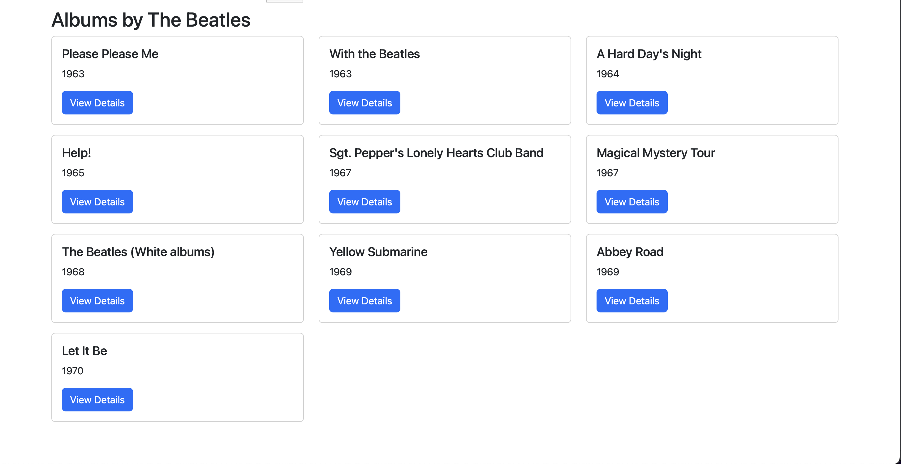
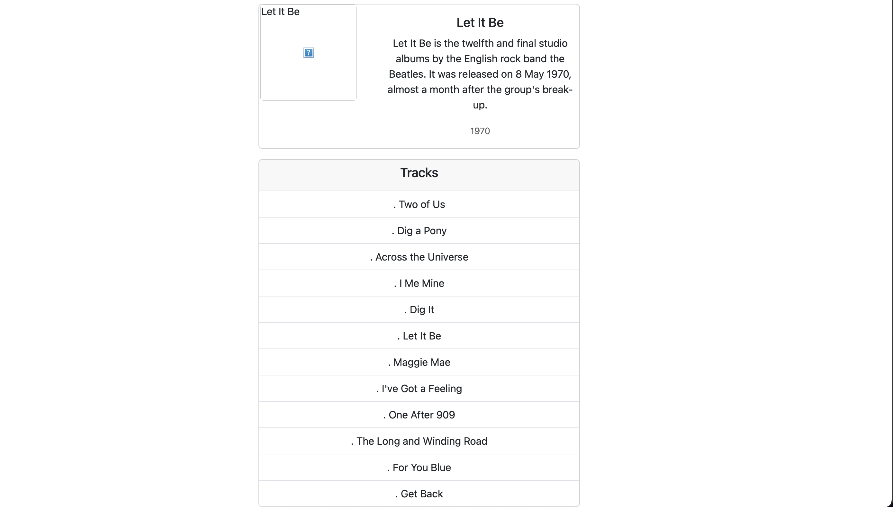
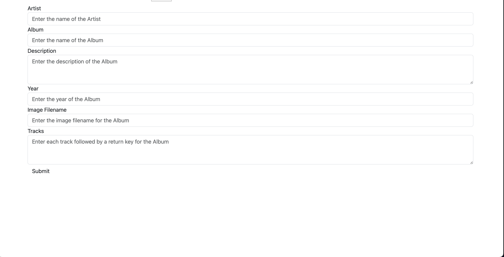

# CST-391 | Activity 4 Angular Music App API Data
#### Author: Trevor Marr
#### Date: 2025 06 Mar
````
**READ ME**

All screenshots and write-ups are my own work, i copied the assignment directions into this file so it is easier to follow.
````
---


## Part 1: Finish the Music Application – Integration with Back End

### Create a Copy of the Music Application
1. Create a new directory where you want the updated Music application to be located.
2. Copy the musicapp (make sure to copy ALL hidden files and folders) directory from the Topic 3 Workspace to the new directory created in the previous step.
3. Open VS Code. Close the current Workspace.
4. Click the App Workspace Folder hyperlink from the VS Code start screen.
5. Select the musicapp directory where the updated music application was copied to. Refresh the Workspace by clicking the Refresh Explorer icon.
6. Select the File > Save Workspace As menu options and save your Workspace so VS Code can be opened again in the future

### Add the HTTP Client Module to the application:
1. Open the App Module app.module.ts file located in the src/app directory. Add the HttpClient Module import as shown below and add the Module to the imports list.
````ts
import { HttpClientModule } from '@angular/common/http';
imports: [
BrowserModule,
HttpClientModule,
FormsModule,
AppRoutingModule
],
````

### Refactor the Music Service, music-service.service.ts
Remove the Hard-Coded Data and Use HttpClient to get Live Data

1. Inject an instance of the HttpClient in the constructor.
````ts
constructor(private http: HttpClient) {}
````

2. As you work, remove the methods that use hard-coded data and then finally remove the hard-coded data. You should be able to run and test incrementally as you work through the methods.
3. Add a new private Http connection property (my Express MusicAPI server listens to port 5000):
4. Update the getArtists() method:
   - Update the method signature to add a callback method and remove its return parameter:
   - Update the call in list-artists.component.ts:
   - You should be able to test the updated getArtists method in your Angular UI. Of course, its results are not compatible with the hard-coded data, but you should be able to now view a live list of artists
   - This is a good time to think about:
     - How the asynchronous calls are working in Angular.
     - How these calls are similar to the asynch programming we did for the Express API. However, those methods used JavaScript promises. We can use those in Angular, but the Angular HttpClient is built around Observables. Read more here.
5. JavaScript Promises are single-use mechanisms. An asynchronous call is made and the Promise either resolves or rejects, then it is done. Observables are not single-use mechanisms. A subscription can receive a stream of updates. This is an advantage, but forgetting to unsubscribe can cause a harmful resource leak as the subscription will continue to work in a zombie fashion after its host component is destroyed. We have no zombies in our application, the HttpClient methods automatically unsubscribe when the call is complete.
   - Examine how callback methods are defined. The syntax makes sense, but I had to try a lot of combinations to get it to work
     - Understand this syntax: `this!.artist!.artist`
6. Do the remaining work of replacing the hard-coded data with live API data. The complete code for music-service.service.ts is provided later in Figures 5 and 6. You must modify the calling code, replacing data structures with callback methods.
   - Replace the methods in music-service.service.ts one by one.
   - Since the method signature will change, update the calling code. Follow the pattern shown by getArtists.
   - Test the updated method.
   - Repeat steps 1 through 3 until complete.
     - A tricky call: list-albums.component.ts, the other service calls are left to the reader.
7. Test final application:
- Take captioned screenshots for the following:
  - Main Application screen
    - 
  - Artist List screen,
    - 
  - Album List screen
    - 
  - Album Display (with tracks) screen
    - 
  - Add Album screen
    - 


### Research
Research how an Angular application maintains a logged in state. How does it communicate this state to the server?
- An Angular application typically maintains a logged-in state using authentication tokens, such as JSON Web Tokens (JWT), which are stored in the browser’s `localStorage`, `sessionStorage`, or as HTTP-only cookies. Upon successful login, the server issues a token that the client stores and includes in subsequent requests, usually in the `Authorization` header as a Bearer token. This ensures that each request is authenticated without requiring the user to log in again. To communicate this state to the server, Angular uses HTTP interceptors to automatically attach the token to outgoing requests. The server then validates the token to confirm the user's identity and permissions. If the token is expired or invalid, the server responds with an unauthorized status, prompting the Angular app to log the user out or refresh the token if a refresh mechanism is implemented. This approach ensures a secure and seamless authentication experience.