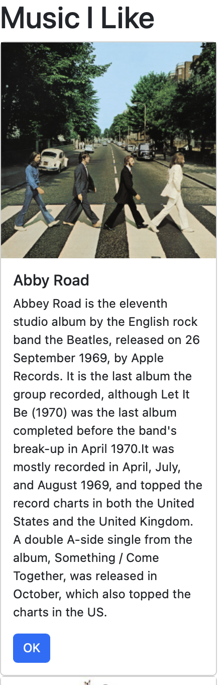
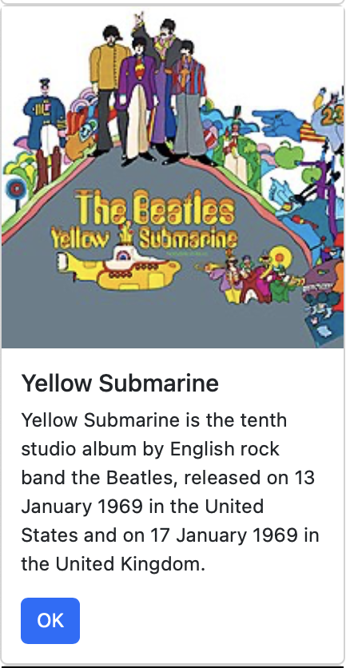
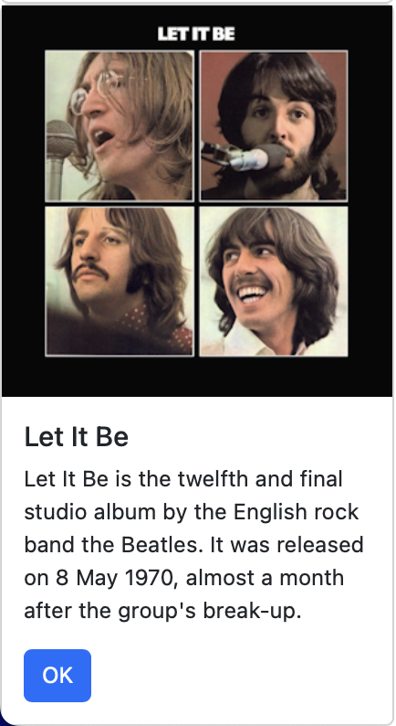
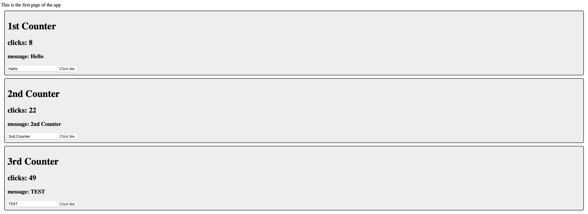
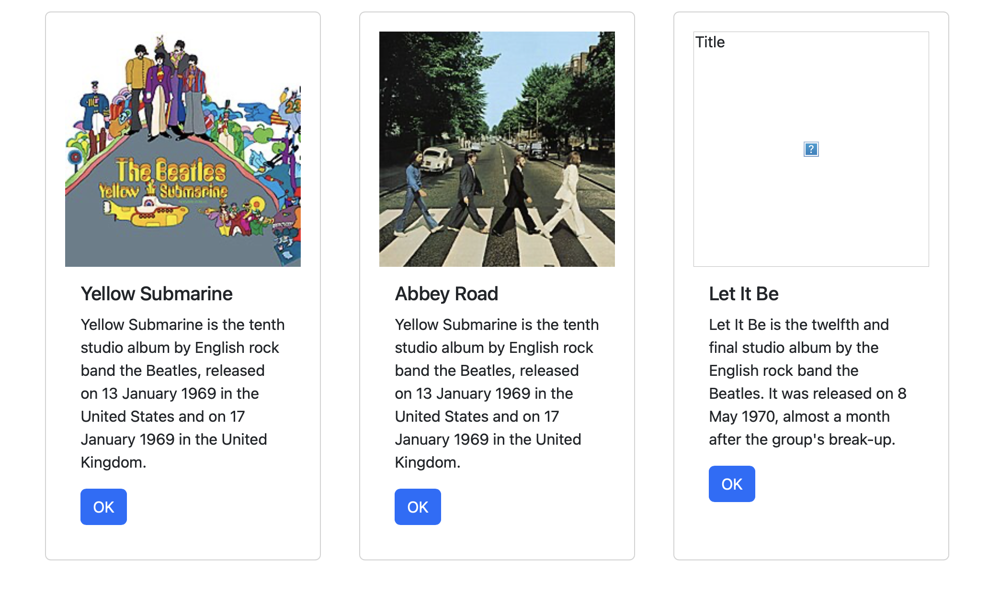

# Activity 5

- Author:  Trevor Marr
- Date:  27 Feb 2025

## Test Links

- http://localhost:3000
- https://getbootstrap.com/docs/5.3/components/card/
- https://www.bootstrapcdn.com/

## Deliverables

### Part 1 - React Music App
- Screenshot of the react music app
  
||||
|--|--|--|
|||

- Summary of Part 1

This part of the activity taught me how to build a new React App from scratch and how component based programming works. Unlike other programming languages, React seems to work better where there is less code on the page and it is split into multiple components.

### Part 2 - State Changer Demo
- Screenshot of the react statechanger app

### Part 3 - Using State and Props in the Music Application
- Screenshot of the updated react music app.

## Conclusion

- This assignment helped me learn how to build a React app and integrate various components such as counters, cards, and Bootstrap elements. It gave me a better understanding of how to structure a React project and style it using external libraries.