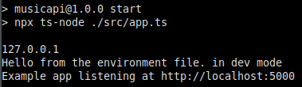
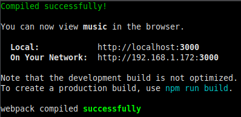
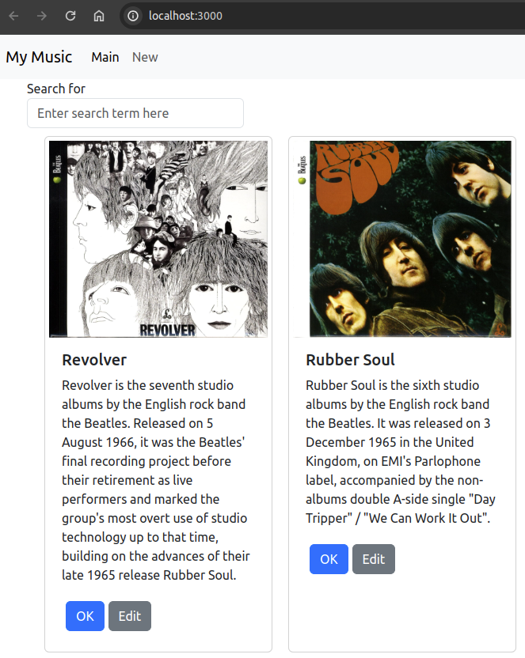

# Activity 7

- Author:  Robert (Bobby) Estey
- Date:  27 October 2024

## Introduction

- Explain this assignment throughly ...

## Activity 7 Commands

```
cd activity1/MusicAPI
npm start
```



```
cd activity7/music
npm start
```



## Test Links

- [Review Activity 1 - Port 5000:  http://localhost:5000](../topic01/activity1.md)
- http://localhost:3000



## Deliverables

- Cover Page
- Executive Summary
- Captioned screenshots with explanations of each page
     - Take screenshots of the application you created
     - Be sure to show the various features that were illustrated in this lesson
     - Write a one-paragraph summary of the new features that have been added
     - Define new terminology that was used in the lesson
- Conclusion

## Conclusion

- Explain what you learned on this assignment throughly ...

## Troubleshooting

|Issue|Solution|
|--|--|
||||
