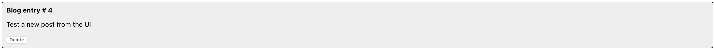
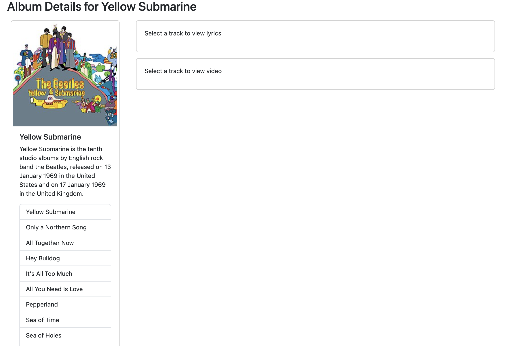

# Activity 7

- Author:  Robert (Bobby) Estey
- Date:  27 October 2024

## Deliverables

### Part 1: Blog Post

- Screenshot of blog post app after making one post.

- Screenshot of multiple blog posts hard-coded.

- Screenshot of each post with a Delete button that when clicked will remove that post from the list

- Screenshot of the feature to add new posts using the text area at the top of the page, Each new post will automatically get a unique ID.

### Part 2: Tracks, Lyrics and Video

- Screenshot of all albums view

- Screenshot of selected album detail view

- Screenshot of a selected song from the album with the lyrics and video view

#### Conclusion
In this activity, we enhanced the music application by implementing interactive album details functionality using React components and state management. The key features added include a track selection system that displays song lyrics and embedded YouTube videos when a track is selected. We utilized React Hooks (useState) for managing component state, and implemented conditional rendering to show/hide content based on user interactions. The application now uses React Router for navigation between views, and axios for API communication with the backend server. New terminology introduced includes "conditional rendering" (showing different UI elements based on conditions), "state management" (handling dynamic data within components), and "props drilling" (passing data through multiple component levels). The enhancements demonstrate the power of React's component architecture and the importance of proper state management in creating interactive web applications.

### Part 3: Create New Album

- Screenshot of the create new album form

- Screenshot of the album details page of the new album that was created

#### Conclusion
I added a fully functional form to the music app with controlled components using `useState` for state management, along with proper event handling via `handleChange` and form submission through `handleSubmit`. The form includes Bootstrap styling, input validation with required fields, and follows JSX conventions like using `className`. It supports both creating new albums and editing existing ones, incorporates error handling for API calls, and leverages `useNavigate` for smooth routing.

### Part 4: Edit Album

- Screenshot of the edit album form

- Screenshot of the fully edited album in the album details page

#### Conclusion
In this section, we implemented an album editing feature by modifying the existing NewAlbum component to handle both creation and editing functionalities. Instead of creating a separate EditAlbum component, we chose to refactor the existing component to support both operations, following the DRY (Don't Repeat Yourself) principle. The component now detects whether it's in edit mode based on the presence of album data in props, and adjusts its behavior accordingly. This approach ensures consistent form handling, reduces code duplication, and simplifies maintenance. The implementation includes proper state management for form fields, handles API interactions for both POST and PUT requests, and provides error handling for a robust user experience.

## Conclusion

In this assignment, we built a comprehensive React application that demonstrates several key aspects of modern web development. We started with a basic blog post application to understand React's core concepts of state management and component interaction. Then, we enhanced our music application with multiple sophisticated features: an interactive album detail system with track selection, lyrics display, and YouTube video integration; a robust form system for creating new albums with controlled components and proper validation; and a unified edit/create component that follows the DRY principle. Throughout the implementation, we utilized React Hooks (useState) for state management, React Router for navigation, axios for API communication, and Bootstrap for styling. The project highlighted important concepts like conditional rendering, proper error handling, and the benefits of component reusability. By choosing to modify existing components rather than create duplicate ones, we created a more maintainable codebase that demonstrates best practices in React development.